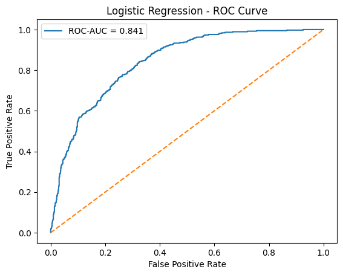
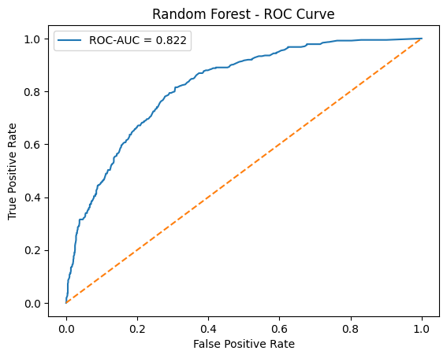
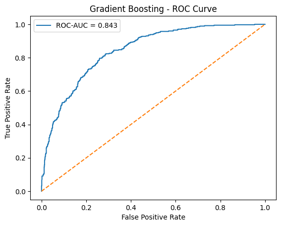
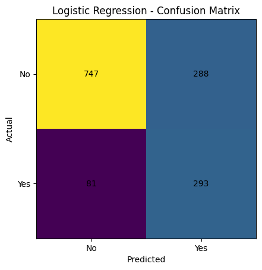
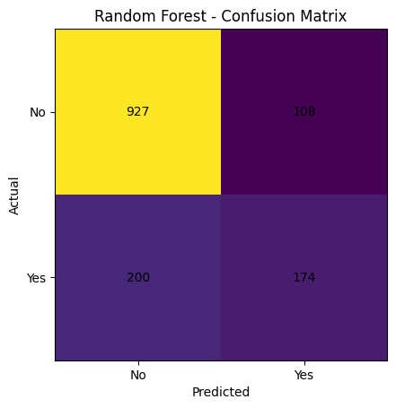
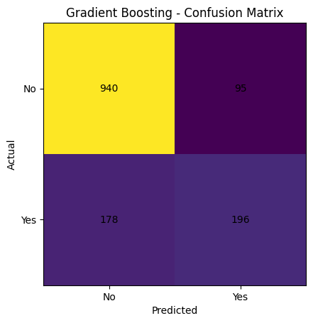
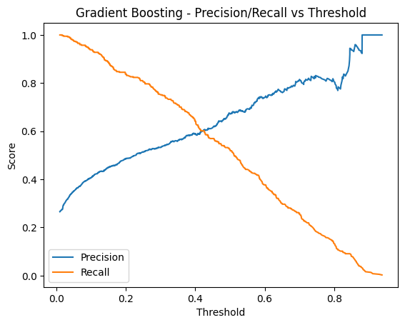
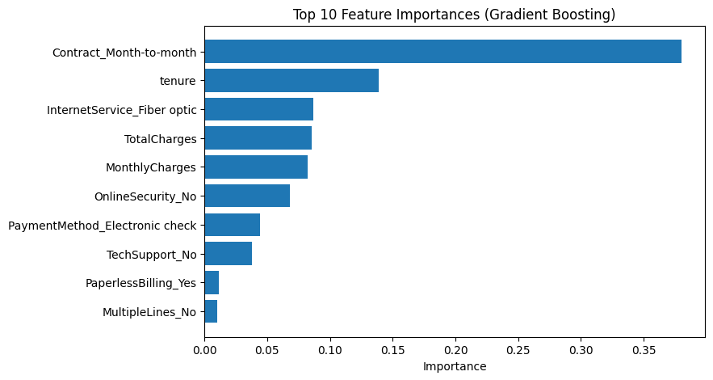
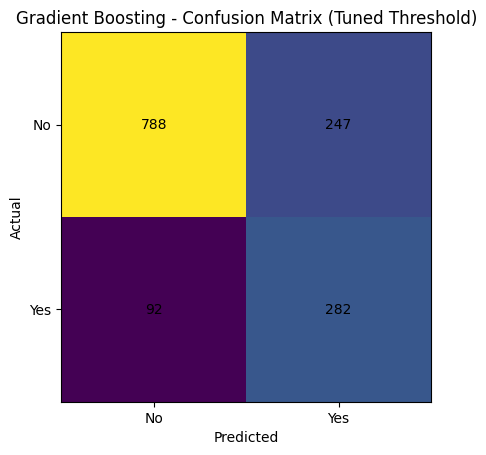

# Customer Churn Prediction Using Machine Learning

**Project Overview**

This project builds a machine learning model to predict customer churn using customer demographics, subscription details, and billing information. The objective is to identify customers who are likely to leave so that businesses can take proactive retention actions. The project demonstrates an end-to-end supervised learning workflow with a strong focus on business-relevant evaluation and model interpretability.

**Dataset**

Telco Customer Churn Dataset (Kaggle)

Dataset: https://www.kaggle.com/datasets/blastchar/telco-customer-churn?utm_source=chatgpt.com&select=WA_Fn-UseC_-Telco-Customer-Churn.csv

The dataset contains customer information including:

- Demographics

- Services and add-ons

- Contract type and billing details

- Target variable: Churn (Yes / No)

**Objectives**

- Build a reliable churn prediction model

- Compare multiple machine learning models

- Evaluate performance using churn-relevant metrics

- Tune decision thresholds to support retention strategies

- Identify and interpret key churn drivers

- Translate model results into actionable business recommendations

**Tools and Technologies**

- Python

- pandas, NumPy

- scikit-learn

- matplotlib, seaborn

**Methodology**

1. Data Preparation

    - Converted inconsistent fields to numeric values

    - Removed identifier columns

    - Handled missing values using imputation

    - Encoded categorical variables and scaled numeric features using pipelines

2. Modeling

    - Logistic Regression (baseline)

    - Random Forest

    - Gradient Boosting

3. Evaluation

    - ROC-AUC for overall model discrimination

    - Confusion matrix and classification metrics

    - Precision-Recall analysis

4. Threshold Tuning

    - Adjusted the classification threshold to prioritize churn recall

    - Selected a threshold aligned with business retention goals

5. Interpretability

    - Extracted feature importance from the best-performing model

    - Identified the main drivers of churn behavior

**Model Performance Summary**
| Model               | ROC-AUC   |
| ------------------- | --------- |
| Gradient Boosting   | **0.843** |
| Logistic Regression | 0.841     |
| Random Forest       | 0.822     |

Final Model: Gradient Boosting Classifier
Tuned Threshold: 0.297
Churn Recall (tuned): ~75%

Threshold tuning increased the model’s ability to capture churn-prone customers, which is critical for retention-focused use cases.

**Key Insights**

- Month-to-month contracts are the strongest driver of churn.

- Customers with short tenure are significantly more likely to churn.

- Fiber optic internet users show higher churn risk.

- Higher monthly and total charges correlate strongly with churn.

- Lack of online security and technical support increases churn probability.

- Customers using electronic check payments exhibit higher churn rates.

**Business Recommendations**

- Prioritize retention campaigns for customers on month-to-month contracts.

- Encourage contract upgrades to longer-term plans with targeted incentives.

- Monitor high-charge customers and offer personalized pricing or bundles.

- Improve onboarding and early-stage engagement for new customers.

- Promote security and tech-support services as value-adding features.

- Use churn probability scores with a tuned threshold to trigger proactive outreach.

**Conclusion**

This project demonstrates a complete, business-oriented machine learning pipeline for churn prediction. Gradient Boosting achieved the best overall performance, and threshold tuning improved churn recall to approximately 75%, making the model suitable for retention targeting. Feature importance analysis provided clear insights into churn behavior, enabling data-driven retention strategies.

**Project Highlights**

- Built an end-to-end churn prediction pipeline using scikit-learn pipelines and transformers

- Compared baseline and tree-based models using ROC-AUC and class-level metrics

- Applied threshold tuning to prioritize churn recall for business decision-making

- Identified and interpreted top churn drivers using feature importance

- Translated model outputs into actionable retention strategies

- Demonstrated strong alignment between machine learning and real-world business needs

---

**Charts Preview**

***ROC Curve***

***Confusion Matrix***

***Precision–Recall Curve***

***Feature Importance Chart***

***Threshold Tuning (Recall vs Threshold)***

